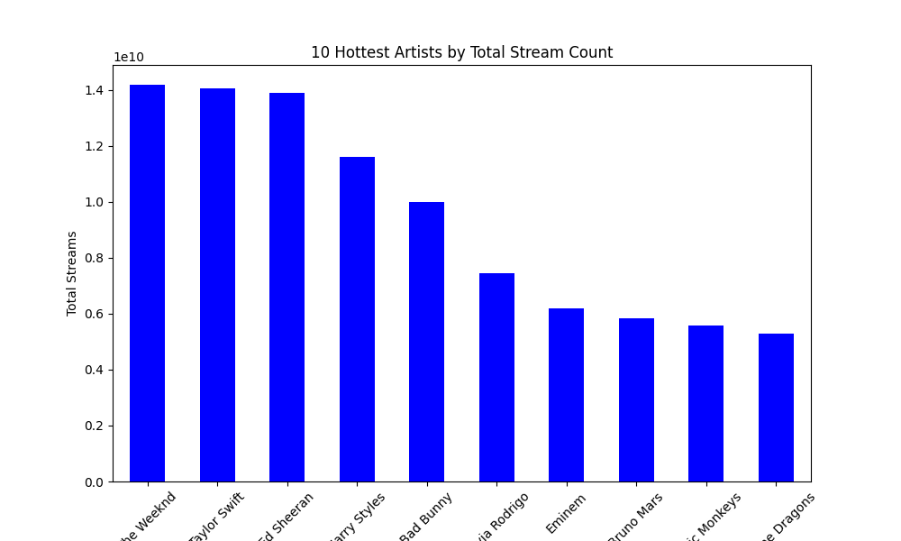

# Mini_Project_2

This is the README for my Mini Project 2 for the IDS706 - Data Engineering Systems class at Duke University.

## Dataset
The dataset comes from Kaggle, a public machine learning and data science community. It contains a CSV file of detailed information regarding the most-streamed Spotify songs in 2023. Link: https://www.kaggle.com/datasets/nelgiriyewithana/top-spotify-songs-2023/data

## Data Visualization
For the visualization, I analyzed and visualized the 10 hottest artists by their stream counts.

